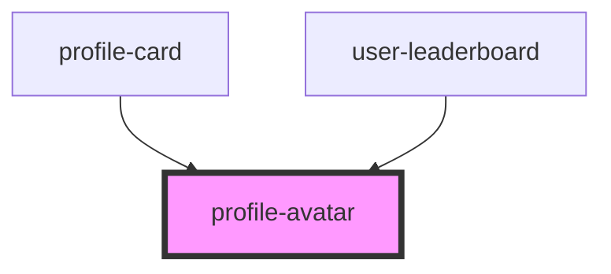

# profile-avatar

<!-- Auto Generated Below -->

## Properties

| Property | Attribute | Description | Type     | Default         |
| -------- | --------- | ----------- | -------- | --------------- |
| `name`   | `name`    |             | `any`    | `getUsername()` |
| `size`   | `size`    |             | `string` | `'medium'`      |

## Dependencies

### Used by

 - [profile-card](../../molecules/ProfileCard)
 - [user-leaderboard](../../molecules/Leaderboard)

### Graph

----------------------------------------------

*Built with [StencilJS](https://stenciljs.com/)*
