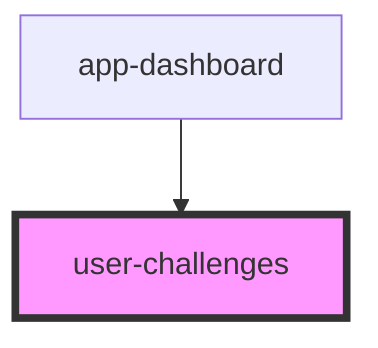

# tracking-time

<!-- Auto Generated Below -->

## Properties

| Property          | Attribute              | Description | Type      | Default                                                             |
| ----------------- | ---------------------- | ----------- | --------- | ------------------------------------------------------------------- |
| `xp2500Collected` | `xp-2-5-0-0-collected` |             | `boolean` | `localStorage.getItem('xp2500Collected') === 'true' ? true : false` |
| `xp500Collected`  | `xp-5-0-0-collected`   |             | `boolean` | `localStorage.getItem('xp500Collected') === 'true' ? true : false`  |

## Dependencies

### Used by

 - [app-dashboard](../../pages/Dashboard)

### Graph

----------------------------------------------

*Built with [StencilJS](https://stenciljs.com/)*
