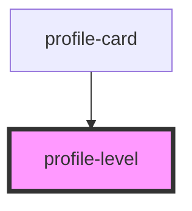

# profile-level

<!-- Auto Generated Below -->

## Properties

| Property   | Attribute  | Description | Type     | Default         |
| ---------- | ---------- | ----------- | -------- | --------------- |
| `username` | `username` |             | `string` | `getUsername()` |

## Dependencies

### Used by

 - [profile-card](../../molecules/ProfileCard)

### Graph

----------------------------------------------

*Built with [StencilJS](https://stenciljs.com/)*
